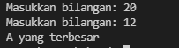

# Struktur kondisi
## Latihan 1
-  Buat program sederhada dengan input 2 buah bilangan, kemudian tentukan bilangan terbesar dari kedua bilangan tersebut menggunakan statement if.<p>
- <b>Program</b><p>
```bash
# Program mencari bilangan terbesar dari 2 buah bilangan
a = int(input("Masukkan bilangan: "))
b = int(input("Masukkan bilangan: "))
if a > b:
    print("A yang terbesar")
else:
    print("B yang terbesar")
```
<p>
- <b>Hasil Program</b><p>
- hasil program, saya coba masukkan angkan 20, 12:<p>
<p>
- kita coba dengan angka lain, misal 12, 20:<P>
<p>
<p>

## Program mencari bilangan terbesar dari 3 buah bilangan
### Flowchart
<P>
### >Langkah-langkah program
1. Masukkan ketiga varible<p>

2. Langkah selanjutnya adalah menulis logika untuk mencari angka terbesar, apakah itu a? b? atau c?<P>

### Program
```bash
#program mencari bilangan terbesar dari 3 buah bilangan
a = int(input("Masukkan bilangan A:"))
b = int(input("Masukkan bilangan B:"))
c = int(input("Masukkan bilangan C:"))

if a > b and a > c:
    print("A yang terbesar")
elif b > a and b > c:
    print("B yang terbesar")
else:
    print("C yang terbesar")
```
### Hasil program
- hasil program, saya coba masukkan angkan 50, 40, 22:<p>

- kita coba dengan angka lain, misal 50, 67, 33:<P>

- atau dengan angka, 23, 65, 77:<p>
<p>
# THANKS....